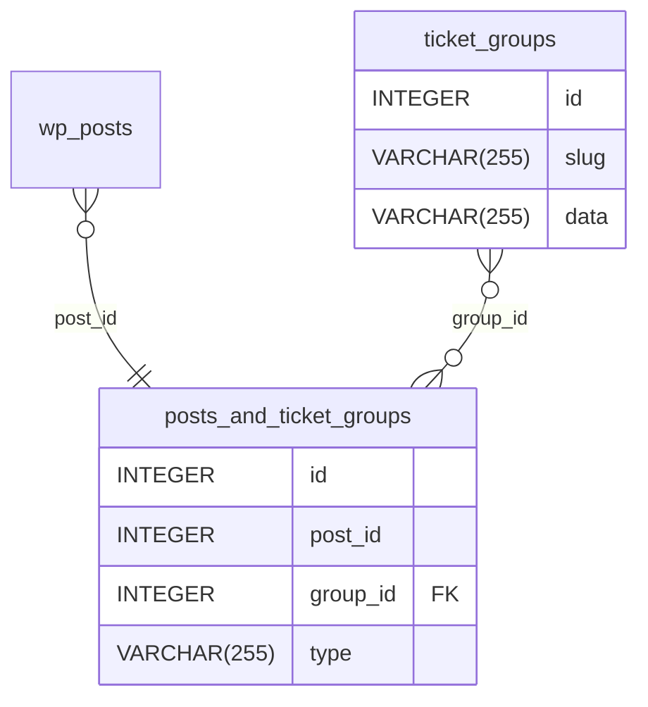

# Flexible Tickets for Event Tickets - Custom Tables Structure

What follows is a description of the custom tables that are used by the Flexible Tickets plugin.
This is intended to be used as a reference for developers who are working on the plugin.

## Tables overview and relationships

The plugin uses 5 custom tables per site; in a multisite installation context, each site will have its own set of custom
tables.
In describing the tables, we'll use the `wp_` table prefix as a convention when indicating the full name of the table.

### Ticket Groups

The `wp_tec_ticket_groups` table is used to model Ticket Group entities.
A Ticket Group is a way to group tickets (posts in the `wp_posts` table) together, without having to store their
relationship on the post itself like Recurring Events used to be modeled in pre-6.0 TEC implementations, where one
Event would be first among equals (`post_parent` to all the other Events) and the others would be "children" of the
first Event. This entity will avoid that "same but different" problem.

The table has the following structure:

| Column | Type             | Description                                                                     |
|--------|------------------|---------------------------------------------------------------------------------|
| `id`   | unsigned integer | The primary key of the record.                                                  |
| `slug` | string           | The slug of the Ticket Group.                                                   |
| `data` | string           | A JSON-encoded string of data that can be used to store additional information. |

### Posts and Ticket Groups

The `wp_tec_posts_and_ticket_groups` table is used to model the many-to-many relationship between Posts and Tickets.
The table is used by the Flexible Tickets plugin to store the relationship between a Series (a post in the `wp_posts`
table) and a Ticket Group.

The table has the following structure:

| Column     | Type             | Description                                                  |
|------------|------------------|--------------------------------------------------------------|
| `id`       | unsigned integer | The primary key of the record.                               |
| `post_id`  | unsigned integer | The ID of the Post that is part of the relationship.         |
| `group_id` | unsigned integer | The ID of the Ticket Group that is part of the relationship. |
| `type`     | string           | The type of relationship represented.                        |

