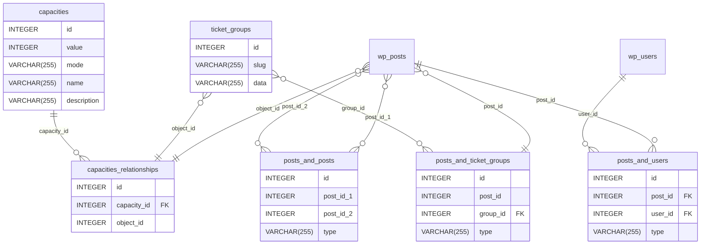

# Flexible Tickets for Event Tickets - Custom Tables Structure

What follows is a description of the custom tables that are used by the Flexible Tickets plugin.
This is intended to be used as a reference for developers who are working on the plugin.

## Tables overview and relationships

The plugin uses 5 custom tables per site; in a multisite installation context, each site will have its own set of custom
tables.
In describing the tables, we'll use the `wp_` table prefix as a convention when indicating the full name of the table.

### Capacities

The `wp_tec_capacities` table is used to model Capacity entities.
Intuitively, a Capacity entity represents a number of tickets that can be sold for a given event.
Capacities are "buckets" of tickets that can be sold for an event, and they can be shared across multiple objects like
Posts (any post type), Ticket Groups, Series, Events and Occurrences.

The table has the following structure:

| Column        | Type             | Description                                                                |
|---------------|------------------|----------------------------------------------------------------------------|
| `id`          | unsigned integer | The primary key of the record.                                             |
| `value`       | signed integer   | The current capacity value, or `-1` to indicate the capacity is unlimited. |
| `mode`        | string           | The type of capacity, e.g. `shared` or `own`.                              |
| `name`        | string           | The human-readable name of the capacity, e.g. `General Admission`.         |
| `description` | string           | The human-readable description of the capacity.                            |

### Capacities Relationships

The `wp_tec_capacities_relationships` table is used to model the relationships between Capacity entities and other
objects like Posts (any post type), Ticket Groups, Series, Events and Occurrences.

The table has the following structure:

| Column        | Type             | Description                                              |
|---------------|------------------|----------------------------------------------------------|
| `id`          | unsigned integer | The primary key of the record.                           |
| `capacity_id` | unsigned integer | The ID of the Capacity entity part of this relationship. |
| `object_id`   | unsigned integer | The ID of the object part of this relationship.          |

The table has one foreign key constraint on the `capacity_id` to remove the capacity relationship when
the capacity is deleted.
Due to the varied nature of the objects that can be related to a Capacity, the foreign key constraint is not
enforced on the `object_id` column.

### Ticket Groups

The `wp_tec_ticket_groups` table is used to model Ticket Group entities.
A Ticket Group is a way to group tickets (posts in the `wp_posts` table) together, without having to store their
relationship on the post itself like Recurring Events used to be modeled in pre-6.0 TEC implementations, where one
Event would be first among equals (`post_parent` to all the other Events) and the others would be "children" of the
first Event. This entity will avoid that "same but different" problem.

The table has the following structure:

| Column | Type             | Description                                                                     |
|--------|------------------|---------------------------------------------------------------------------------|
| `id`   | unsigned integer | The primary key of the record.                                                  |
| `slug` | string           | The slug of the Ticket Group.                                                   |
| `data` | string           | A JSON-encoded string of data that can be used to store additional information. |

### Posts and Posts

The `wp_tec_posts_and_posts` table is used to model the relationships between Posts (any post type) and other Posts.
This table is used to model the relationships between any two Posts, entities modeled in the `wp_posts` table.

The table has the following structure:

| Column      | Type             | Description                                                                  |
|-------------|------------------|------------------------------------------------------------------------------|
| `id`        | unsigned integer | The primary key of the record.                                               |
| `post_id_1` | unsigned integer | The ID of the first Post part of this relationship.                          |
| `post_id_2` | unsigned integer | The ID of the second Post part of this relationship.                         |
| `type`      | string           | The type of relationship, e.g. `series_and_ticket` or `attendee_and_ticket`. |

To allow for TEC CT1 Occurrences to be supported in this table, there is no foreign key constraint on the `post_id_1`
and `post_id_2` columns: each of these columns can be a Post ID or an Occurrence ID.

The `type` column is used to indicate the type of relationship between the two Posts and make researching the
relationships easier.
The class `TEC\Tickets\Flexible_Tickets\Custom_Tables\Posts_And_Posts` defines a set of constants that MUST be used to
build the string that will be stored in the `type` column according to the following pattern:

* `TYPE_TICKET_AND_POST_PREFIX` e.g. `ticket_and_post_post` or `ticket_and_post_tribe_event_series` to indicate a relationship
  between a Ticket and a Post of a given type.
* `TYPE_TICKET_AND_ATTENDEE` to indicate a relationship between a Ticket and an Attendee.
* `TYPE_TICKET_AND_ORDER` to indicate a relationship between a Ticket and an Order.
* `TYPE_ORDER_AND_POST_PREFIX` e.g. `order_and_post_post` or `order_and_post_tribe_event_series` to indicate a relationship
  between an Order and a Post of a given type.
* `TYPE_ORDER_AND_ATTENDEE` to indicate a relationship between an Order and an Attendee.
* `TYPE_ATTENDEE_AND_POST_PREFIX` e.g. `attendee_and_post_post` or `attendee_and_post_tribe_event_series` to indicate a
  relationship between an Attendee and a Post of a given type.

### Posts and Users

The `wp_tec_posts_and_users` table is used to model the relationships between Posts (any post type) and Users of the
site.
While Users are modeled on a global table in a multisite installation, the relationships between Users and Posts are
stored on a per-site basis.

The table has the following structure:

| Column    | Type             | Description                                                                   |
|-----------|------------------|-------------------------------------------------------------------------------|
| `id`      | unsigned integer | The primary key of the record.                                                |
| `post_id` | unsigned integer | The ID of the Post part of this relationship.                                 |
| `user_id` | unsigned integer | The ID of the User part of this relationship.                                 |
| `type`    | string           | The type of relationship, e.g. `attendee_and_ticket` or `attendee_and_event`. |

The table has two foreign key constraints on the `post_id` and `user_id` columns to remove the relationship when
either the Post or the User are deleted.

The `type` column is used to indicate the type of relationship between the User and the Post and make researching the
relationships easier.
